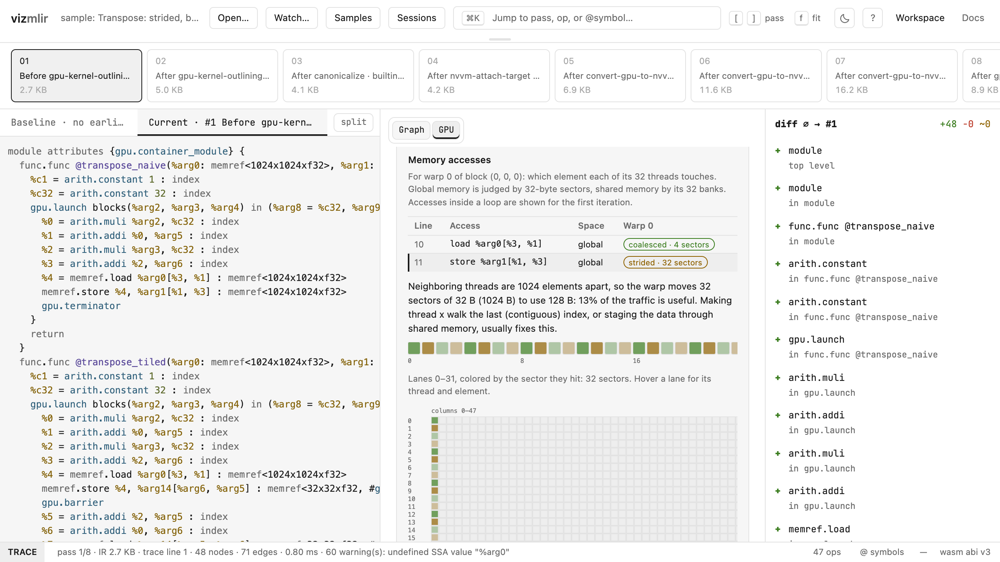
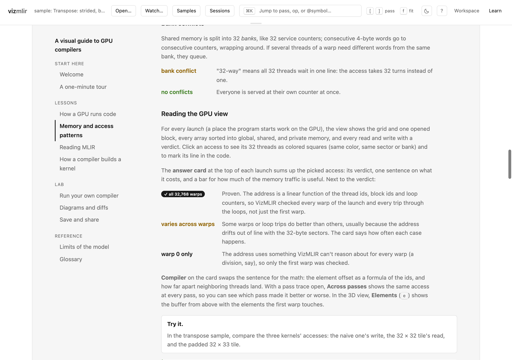

# VizMLIR

[](LICENSE)

A lightweight, browser-based visualizer for MLIR. Designed primarily for compiler engineers who need to inspect lowering passes and understand IR flow without the noise of raw text logs.

**[Try VizMLIR live](https://joepothiboot.github.io/vizmlir/)**





## Why VizMLIR?

Parsing complex MLIR by eye is a bottleneck. VizMLIR provides an interactive graph interface to render your IR instantly. It’s built to be a simple, "no-friction" tool that you can keep open in a side tab while you iterate on your compiler passes.

## Who is it for?

- **Compiler engineers:** Inspect MLIR graphs and compare the effect of lowering passes.
- **Frontend engineers:** Explore the React and WebAssembly implementation, or contribute improvements to the UI.
- **Technical readers:** Build an intuition for how MLIR operations connect without needing to read raw dumps alone.

## Features

- **Interactive Graphs:** Visualize nodes and operations as they connect through your IR.
- **Pass Traces:** Open `mlir-opt -mlir-print-ir-after-all` output (or from any out-of-tree `*-opt` driver) and step through each pass with its before/after diff, failures, and diagnostics. The accepted format is documented in [docs/trace-format.md](docs/trace-format.md).
- **Pass Timing:** Add `-mlir-timing` to see each pass's wall time and IR size in the timeline, and the full report with `p`. Run under `/usr/bin/time -l` / `-v` to add peak memory.
- **Op Counts:** Press `o` to see how many of each op every pass leaves in the module, trimmed to the passes and ops that change, to spot a lowering that stopped firing or an op-count blow-up. Exports as CSV.
- **Buffer Memory:** After bufferization, press `b` to see each `memref.alloc` as a live range with its size, the peak live bytes per function, and which buffers a pass added, removed, or now frees differently.
- **Symbol History:** Press `h` to see, for every function, kernel, and GPU module in a trace, which pass created it, changed it, lowered it (`gpu.func` → `llvm.func`), or removed it. Click one to follow just that symbol pass by pass as a diff, down to the PTX it was serialized to. Import kernel times from Nsight Systems, Nsight Compute, Google Benchmark, or your own CSV to see each kernel's time next to the passes that built it, or import a baseline run too to see which kernels got slower. The "GPU kernels + benchmarks (mock)" sample shows this with invented timings ([docs/benchmark-format.md](docs/benchmark-format.md)).
- **Live Reload:** Watch a trace file (Chrome/Edge) and the view refreshes each time `mlir-opt` rewrites it.
- **Save & Export:** The workspace autosaves locally (IndexedDB), named sessions can be saved and shared as `.json`, graphs export as PNG/SVG, and diffs as Markdown/JSON.
- **Keyboard-First:** Jump to any pass, op, or `@symbol` with ⌘K / Ctrl K, step passes with `[` `]`, walk changes with `j` `k` (each change is linked to its graph node and source line), and press `?` for the full list.
- **Low Latency:** Renders changes in real-time as you modify your MLIR.
- **Browser-Native:** Runs entirely on the client side—no backend infrastructure required.
- **Streamlined UI:** Minimalist interface that stays out of your way.

## Quick Start

To run VizMLIR locally:

```bash
git clone https://github.com/joepothiboot/vizmlir
cd vizmlir
npm install
npm run dev
```

1. Open your browser to the local dev address.
2. Paste your MLIR into the input editor.
3. The graph view will generate automatically. Use the navigation controls to zoom or pan.

## Contributing

Feedback and contributions are highly appreciated. See [CONTRIBUTING.md](CONTRIBUTING.md) for the development setup and project conventions. If you encounter a specific MLIR construct that doesn't render as expected, please open an issue with the snippet attached so we can improve the parser.

## License

Distributed under the MIT License. See `LICENSE` for more information.
