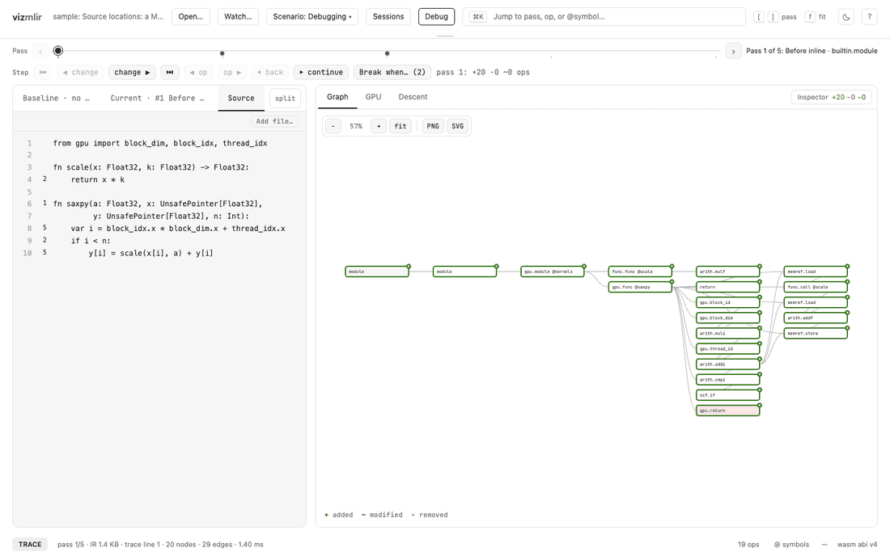

# VizMLIR

[](LICENSE)

VizMLIR is a browser-based viewer for MLIR pass pipelines. You give it the log
from `mlir-opt -mlir-print-ir-after-all` (or any MLIR-based `*-opt` tool), and
it shows how the IR changes pass by pass. For GPU code, it also shows how a
kernel maps onto blocks, warps and memory, and flags memory accesses that the
hardware will handle badly.

Everything runs locally in the browser. The parser is a small Rust crate
compiled to WebAssembly; nothing is uploaded.

Live version: https://joepothiboot.github.io/vizmlir/



## What it does

**Pass debugging**

- Step through the pipeline one pass at a time and see what each pass added,
  removed or changed.
- Map ops back to source lines using the `loc(...)` info printed with
  `-mlir-print-debuginfo`, including `callsite`, `fused` and `#loc` aliases.
- Follow one op across passes: where it was created, lowered, inlined, fused
  or erased.
- Set breakpoints on conditions such as `linalg.matmul == 0`, `ops < 20`,
  `live > 1MB`, `appears gpu.launch` or `fails`, and run to the next hit.
- Show the pipeline as a 3D stack of passes (the Descent view).

**GPU analysis**

- Draw each `gpu.launch` as a grid of blocks, with one block opened into warps,
  and list every buffer by memory space (global, shared, private).
- Classify each load and store per warp: coalesced, strided, misaligned,
  broadcast, or shared-memory bank conflict.
- When an address is affine in thread ids, block ids and loop counters, prove
  the verdict for every warp and loop iteration, not just warp 0.
- Follow an access through the lowering down to the LLVM dialect and PTX.
- Show Triton GPU IR layouts (`#blocked`): which thread holds which tensor
  element, with the same verdicts for `tt.load` and `tt.store`.
- Import measured results from Nsight Systems, Nsight Compute, Google Benchmark
  or CSV and compare two runs.

The predictions were checked against hardware. Predictions written before the
run matched all 22 Nsight Compute counters measured on an NVIDIA T4
([docs/hardware-check.md](docs/hardware-check.md)).

**Other views**

- Scratchpad memory and DMA (`memref.dma_start`/`dma_wait`, nano-dsp's
  `#dsp.local`): buffer budget and the DMA/wait/compute schedule of a loop.
- Per-pass timing from `-mlir-timing`, op counts per pass, buffer lifetimes and
  peak memory, and per-symbol history.
- Plain-language explanation of any IR line.

VizMLIR only reads IR. It doesn't run kernels, so it reports access patterns,
not timings.

## Getting started

Requirements: Node.js 20+, Rust with the `wasm32-unknown-unknown` target.

```bash
git clone https://github.com/joepothiboot/vizmlir
cd vizmlir
npm install
npm run dev
```

The app opens on a sample. Use **Scenario** to switch samples, or **Open…** to
load your own log. Generate one with:

```bash
mlir-opt input.mlir <passes> -mlir-print-ir-after-all -mlir-print-debuginfo -mlir-timing 2> trace.txt
```

Useful shortcuts: `[` / `]` previous/next pass, `⌘K` command palette, `?` all
shortcuts.

Other commands:

```bash
npm test          # unit tests (vitest)
npm run build     # wasm + production build into dist/
```

## How it maps to MLIR

VizMLIR works on printed IR, not on in-memory compiler objects.

| VizMLIR                           | MLIR                                                     |
| --------------------------------- | -------------------------------------------------------- |
| Source position of an op          | `FileLineColLoc`, printed as `loc("f.mojo":12:5)`        |
| Inlined op with callee and caller | `CallSiteLoc`, added by the inliner                      |
| Op with several source positions  | `FusedLoc`, used when a pass merges ops                  |
| Pass slider and Changes tab       | IR dumps from `-mlir-print-ir-after-all`                 |
| Breakpoints                       | Conditions evaluated over those dumps; no compiler hooks |

## Limitations

- Ops are matched between passes by location and name. When a pass removes
  some of several identical ops, their pairing can swap.
- Without `-mlir-print-debuginfo`, matching falls back to name and order and
  the Source view is unavailable.
- The `saxpy` and Triton samples are hand-written in the format of real
  output (Triton doesn't run on macOS). The other samples are real `mlir-opt`
  output.

## Documentation

- [docs/trace-format.md](docs/trace-format.md): accepted log format
- [docs/benchmark-format.md](docs/benchmark-format.md): importing measured results
- [docs/hardware-check.md](docs/hardware-check.md): predictions vs Nsight Compute on a T4
- [docs/DEMO.md](docs/DEMO.md): walkthrough of the debugging sample
- [CONTRIBUTING.md](CONTRIBUTING.md): source layout, conventions, checks

## License

MIT. See [LICENSE](LICENSE).
